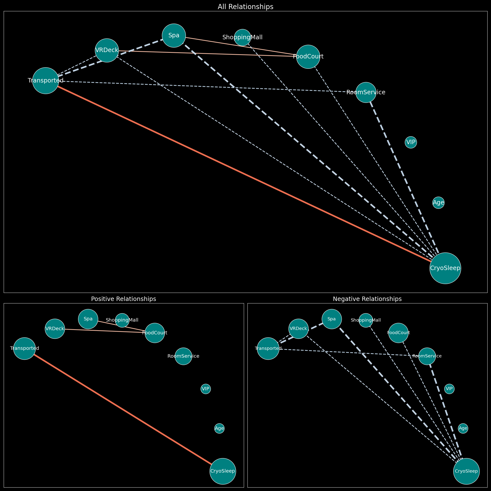

# 🦺 Graphy

Currently Developing!

This module aims to acquire feature relathionship while EDA with graph representation. 

## Example 

### With Target Feature

### Without Target Feature

## Current Function
- Correlation-based Graph (without Direction)

## Requirements

- pandas
- numpy
- networkx
- graphviz
- pygraphviz
- matplotlib

## Future Updates

- Directed Graph with Regression
- Bipartite Graph for Group Difference