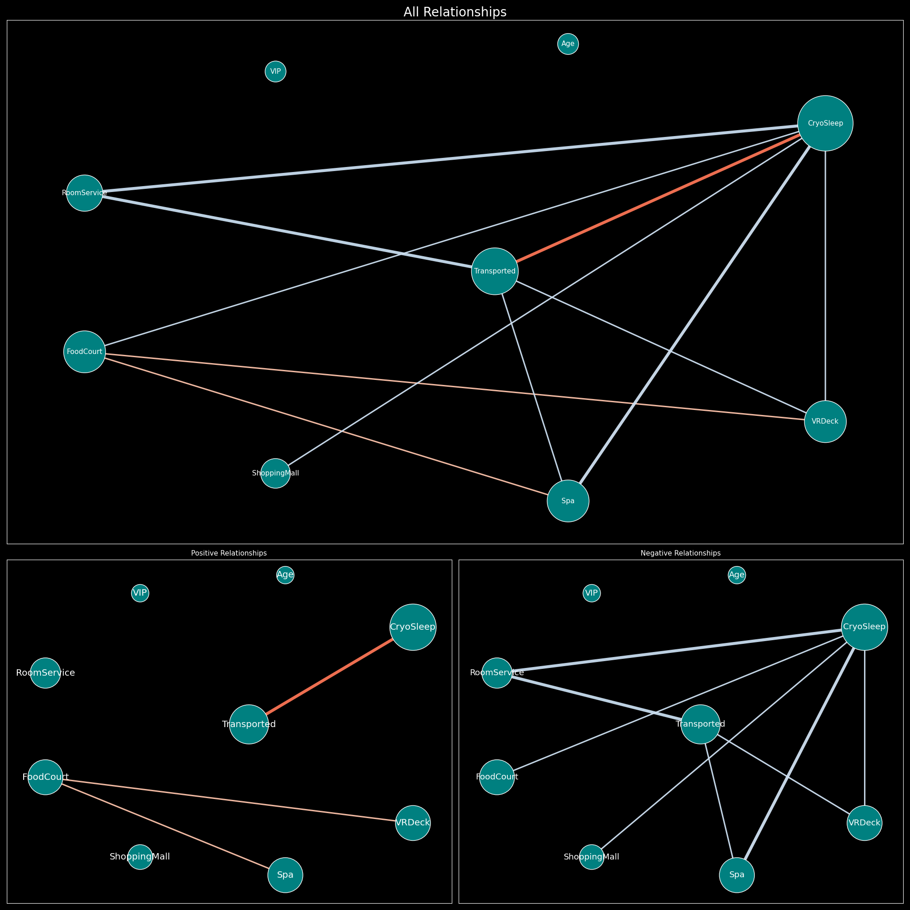
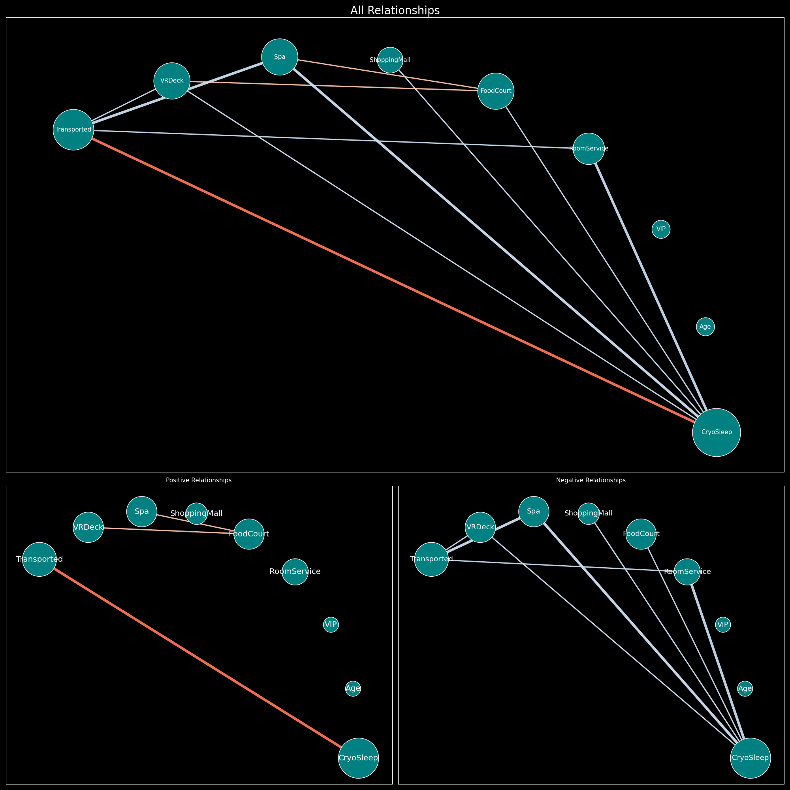

# 👷 Graphy

We're Currently Developing!

This module aims to acquire feature relathionship while EDA with graph representation. 

## Sample Usage

You can check [sample notebook](sample/sample.ipynb)

## How to Read
- Each node (dots) refers to each feature. 
- larger node size means that feature has more statistically meaningful relationship.
- Each edge (lines) indicates ***statistically meaningful*** (p < 0.05) relationships. 
- Each of the red and blue colors is positive and negative relationships.
- higher saturation (more bold color) means stronger relationships

## Example 

### With Target Feature

### Without Target Feature

## Current Function
- Correlation-based Graph (without Direction)

## Requirements

- pandas
- numpy
- networkx
- graphviz
- pygraphviz
- matplotlib

## Future Updates

- Directed Graph with Regression
- Bipartite Graph for Group Difference
